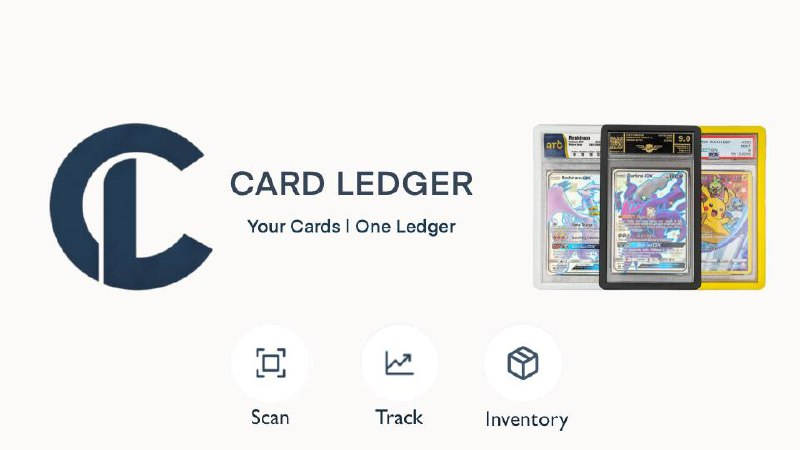

# CardLedger

**Your Cards. One Ledger.**

A professional portfolio tracker for collectible cards — Pokémon, sports cards, Yu-Gi-Oh!, Magic: The Gathering, One Piece, Lorcana, Flesh and Blood, Dragon Ball Super, and more.

<p align="center">
  
</p>

## 🎯 Features

### Portfolio Management
- 📊 **Real-time Dashboard** — Track total value, P&L, and performance over time
- 📸 **Quick Add** — Scan barcodes, search, or use AI to add cards instantly
- 🏷️ **Grading Tracker** — Track submissions to PSA, BGS, CGC, SGC with ROI calculations
- 📁 **Folders & Tags** — Organize your collection your way
- 🔄 **Import/Export** — CSV, Excel, PDF reports with full data portability

### Pricing & Market Data
- 💵 **JustTCG Integration** — Real-time prices across all conditions (NM, LP, MP, HP, DMG)
- 📈 **180-Day Price Charts** — Historical price data with trends
- 💰 **Price Alerts** — Get notified when cards hit your target price
- 📊 **Market Trends** — See what's hot and biggest movers

### Engagement & Social
- 🏆 **Leaderboards** — Compete with other collectors globally
- 🎯 **Collection Goals** — Set and track portfolio targets
- ⭐ **Achievements** — Unlock badges and collector tiers (Bronze → Diamond)
- 🔥 **Daily Login Rewards** — Streaks, XP, and daily tips
- 🔗 **Public Profiles** — Share your collection with custom links
- 📱 **Social Sharing** — Share to Twitter, Discord, WhatsApp, Telegram
- 🔲 **QR Codes** — Generate shareable collection QR codes

### Trading & Sales
- 🔄 **Trading Hub** — Find trade matches with other collectors
- 💹 **Sales Tracking** — Record sales with profit calculations
- 📋 **Client Lists** — Create shareable lists for wholesale/dealers
- 📄 **Tax Reports** — Capital gains calculator, FIFO/LIFO, CSV export for accountants

### Games Supported
- 🟡 Pokémon TCG (250K+ cards via API)
- ⚾ Sports Cards (MLB, NBA, NFL, NHL)
- 🔮 Magic: The Gathering
- 🎴 Yu-Gi-Oh!
- 🏴‍☠️ One Piece Card Game
- ✨ Disney Lorcana
- ⚔️ Flesh and Blood
- 🐉 Dragon Ball Super Fusion World
- And more via JustTCG API (16+ TCGs)

## 🛠️ Tech Stack

- **Frontend**: React 19 + TypeScript + Vite
- **Styling**: Tailwind CSS + shadcn/ui + Radix primitives
- **Animations**: Framer Motion
- **Backend**: Supabase (Auth, PostgreSQL, Edge Functions, Storage)
- **APIs**: JustTCG, Pokémon TCG API, eBay Browse API
- **Mobile**: Capacitor (iOS native coming soon)
- **PWA**: Full offline support with service worker

## 📊 App Stats

- **70+ Components**
- **34 Pages**
- **33 API Hooks**
- **90,000+ Lines of TypeScript**
- **250KB gzipped initial load**

## 🚀 Quick Start

```bash
# Install dependencies
npm install

# Start development server
npm run dev

# Build for production
npm run build

# Preview production build
npm run preview
```

## 📁 Project Structure

```
src/
├── components/     # 70+ React components
├── pages/          # 34 route pages
├── hooks/          # 33 custom hooks
├── lib/            # Utilities & API clients
├── integrations/   # Supabase client & types
└── assets/         # Static assets
```

## 🔧 Environment Variables

```env
VITE_SUPABASE_URL=your_supabase_url
VITE_SUPABASE_ANON_KEY=your_anon_key
```

## 🌐 Deployment

Deployed on Vercel at [usecardledger.com](https://usecardledger.com)

```bash
# Deploy to Vercel
vercel --prod
```

## 📱 Mobile App (Coming Soon)

Native iOS app built with Swift for App Store release.

## 📫 Contact

- **Website**: [usecardledger.com](https://usecardledger.com)
- **Email**: cardledger.llc@gmail.com

## 📄 License

Proprietary — © 2026 CardLedger LLC. All rights reserved.

---

Built with ❤️ by the CardLedger team
